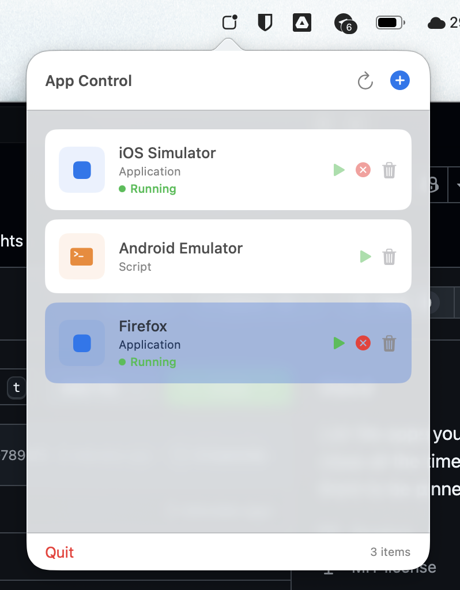

# AppControlPanel

A macOS menu bar application for managing and launching applications and scripts.

## Features

- **Menu Bar Integration**: Lives in your macOS menu bar for quick access
- **Application Management**: Add, remove, and launch applications from a convenient panel
- **Script Support**: Run bash scripts directly from the panel (inline scripts or script files)
- **Force Kill**: Force terminate running applications



## Requirements

- macOS 13.0 or later
- Xcode 15.0 or later

## Installation

### Download

Download the zip file from [release page](https://github.com/wisnuprama/mac-app-control-panel/releases).

1. Unzip the zip file
2. Copy the `AppControlPanel` to `Application` folder.

### Using Xcode

1. Open `AppControlPanel.xcodeproj` in Xcode
2. Build and run the project (⌘R)
3. The app will appear in your menu bar

### Using Build Script (No Xcode UI)

```bash
# Build and run (default)
./build.sh run

# Build only (Debug)
./build.sh build

# Build release version
./build.sh release

# Clean build artifacts
./build.sh clean

# Watch for changes and auto-rebuild (requires: brew install fswatch)
./build.sh watch
```

## Usage

### Adding an Application

1. Click the app icon in the menu bar
2. Click the "+" button
3. Select "Application" type
4. Click "Browse" to select an application from your system
5. Click "Add"

### Adding a Script

1. Click the app icon in the menu bar
2. Click the "+" button
3. Select "Script" type
4. Choose between:
   - **Script File**: Browse to select an existing script file
   - **Inline Script**: Type your bash script directly
5. Click "Add"

### Managing Apps/Scripts

- **Open/Run**: Click the play button to launch an app or run a script
- **Force Kill**: Click the X button to force terminate a running application
- **Remove**: Click the trash button to remove an entry from the list

## Project Structure

```
AppControlPanel/
├── AppControlPanelApp.swift    # Main app entry point and AppDelegate
├── Models/
│   └── AppEntry.swift            # Data model for app/script entries
├── Views/
│   └── ContentView.swift         # Main UI components
├── Services/
│   └── AppManager.swift          # Business logic for app management
├── Database/
│   └── DatabaseManager.swift     # SQLite database operations
├── Assets.xcassets/              # App assets
├── Info.plist                    # App configuration
└── AppControlPanel.entitlements # App entitlements
```

## Database

The app stores data in SQLite at:

```
~/Library/Application Support/AppControlPanel/app_data.sqlite
```

## License

MIT License
